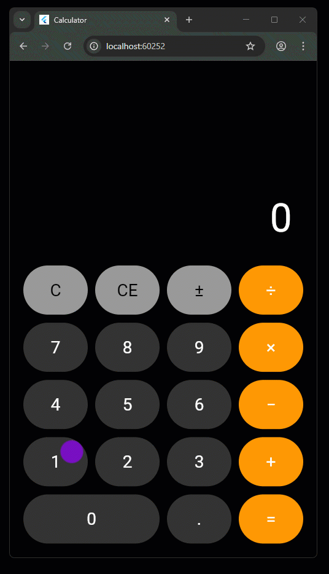
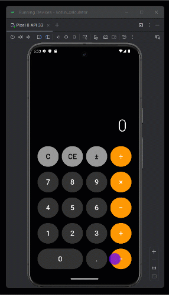
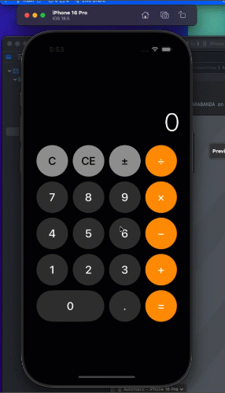

# Cross-Platform Calculator

This is a **cross-platform calculator** built using three different technologies:
- **Flutter** (cross-platform)
- **Kotlin (Native Android)**
- **Swift (Native iOS)**

The purpose of this repository is to **learn, compare, and showcase** how a single idea can be implemented using different mobile development stacks. It's ideal for portfolio building and demonstrating technical versatility.

---

## 📂 Repository Structure

```
cross-platform-calculator/
├── flutter_calculator/
├── kotlin_calculator/
├── swift_calculator/
└── README.md
```

- **flutter_calculator/**  
  Flutter-based app for Android and iOS.

- **kotlin_calculator/**  
  Native Android app using Kotlin.

- **swift_calculator/**  
  Native iOS app using SwiftUI.

---

## 🚀 Core Features

- Basic operations: addition, subtraction, multiplication, division.
- Simple and responsive UI.
- Operation validation (e.g., avoid division by zero).

---

## ✨ Potential Improvements

- **Scientific mode**: square root, percentage, powers.
- **Operation history**.
- **Dark Mode**.
- **Button animations**.
- **Internationalization (i18n)**: English/Spanish.

---

## 📸 Screenshots

### Flutter Calculator


### Kotlin Calculator (Android)


### Swift Calculator (iOS)


---

## 🔧 Installation & Run Instructions

### Flutter
1. Install dependencies:
   ```bash
   flutter pub get
   ```
2. Run on emulator or device:
   ```bash
   flutter run
   ```

### Kotlin (Android)
1. Open the project in Android Studio.
2. Sync Gradle.
3. Run on an Android emulator or physical device.

### Swift (iOS)
1. Open `swift_calculator/calculator/calculator.xcodeproj` in Xcode.
2. Select a simulator or connected device.
3. Build and run (`Cmd + R`).

#### Swift Calculator Features:
- ✅ **Complete calculator functionality** with all basic operations
- ✅ **SwiftUI-based interface** with modern iOS design
- ✅ **Error handling** for division by zero and invalid operations
- ✅ **Number formatting** with automatic decimal/integer display
- ✅ **Sign toggle functionality** (±)
- ✅ **Clear and Clear Entry** operations
- ✅ **Responsive design** for all iPhone and iPad sizes

---

## 🤝 Contributing

Contributions are welcome! Feel free to open an **issue** or submit a **pull request** with suggestions or improvements.

---

## 📜 License

This project is licensed under the MIT License. See the LICENSE file for more details.

---
